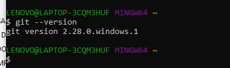
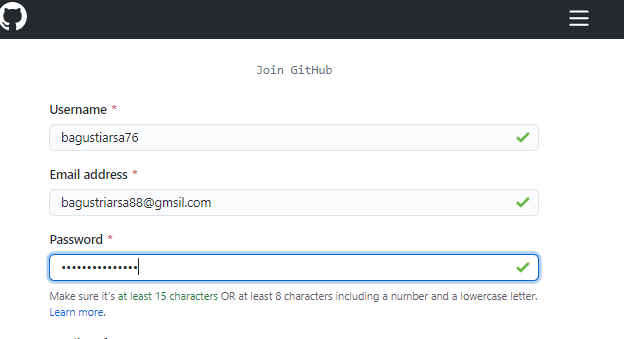
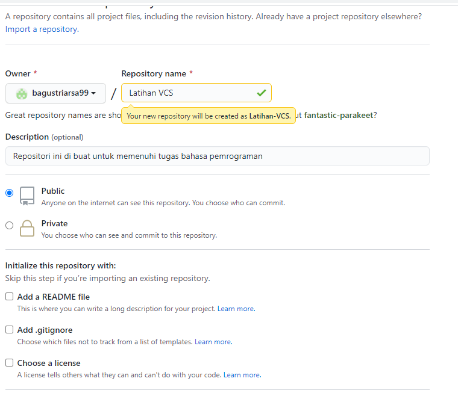
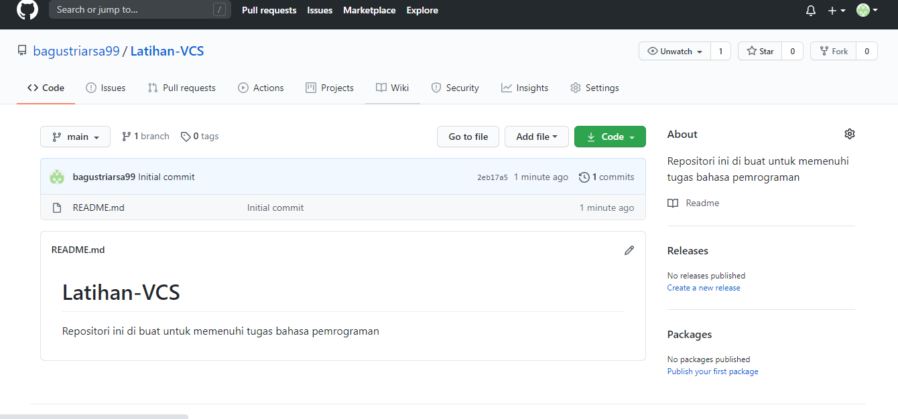
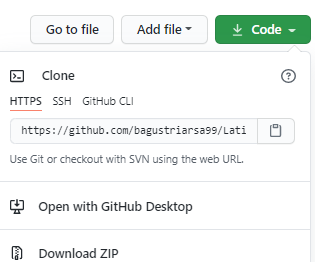
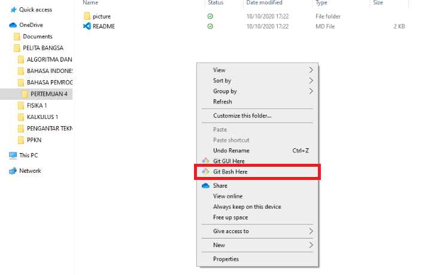
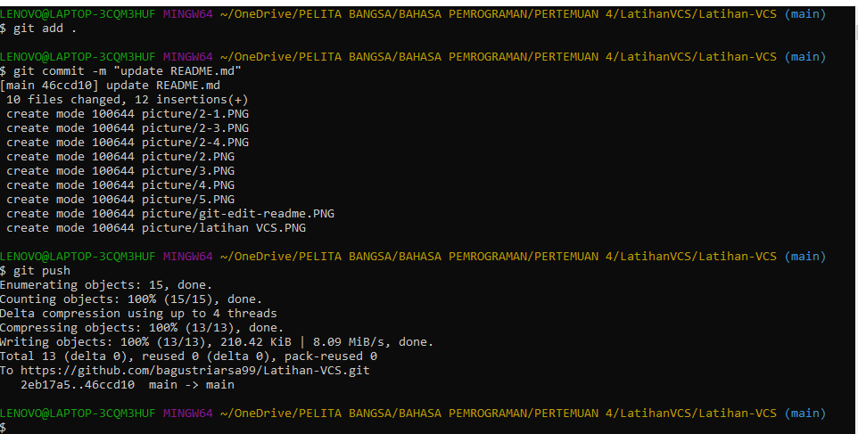

# Latihan-VCS
Repositori ini di buat untuk memenuhi tugas bahasa pemrograman
Nama        :Bagus triarsa

NIM         :312010202

Kelas       :TI.20.B.1

Matkul      :Bahasa Pemprograman

## Langkah langkah penggunaan git

* Download Git dahulu, dengan link berikut ini : [Click here](https://git-scm.com/)

* Setelah file terdonwload, silahkan lakukan instalasi dengan reerensi berikut ini : [git instalation Guide](https://phoenixnap.com/kb/how-to-install-git-windows)

* Setelah Instalasi selesai, buka *softwere* GitBash pada menu di Windows, dan lakukan pengecekan Versi, dengan mengetik *syntax* berikut :[git instalation guide] 
> git --version

* Buat akun https://github.com/, seperti contoh dibawah ini. Dan lakukan *verifikasi* akun melalui email yang sudah terdaftar.

* Jika akun GitHub sudah selesai dibuat dan terverivikasi, proses selanjutnya silahkan buat *Repository* seperti gambar dibawah ini. 

* Jika repositiry sudah didibuat maka akan muncul tampilan seprti dibawah ini.

* Pembuatan akun dan repository pada GitHub telah selesai, saat ini akan kita lakukan untuk *me-remote* reposytory GitBash lokal. Bagaimana caranya? Langkah pertama kita harus menyalin *link* *URL* git kita di GitHub, dengan cara tekan tombol code lalu klik *Copy*

* Setelah *Link URL* git kita ter*copy*, Silahkan buka File Explirer pada Windows, kemudian pilih folder dimana kita akan men*donwload*nRepository dari GitHub ke lokal. Kemudian Klik Kanan, pilih **Git Bash Here**.

* Pop *Up Command Promot* (CMD) akan terluka. pada proses ini kita akan melakukan download file repository yang tadi dibuat, dengan mengetikkan *syntax* berikut :
> git clone [URL] pada contohnya, saya akan memasukkan *git clone https://github.com/bagustriarsa99/Latihan-VCS.git*

