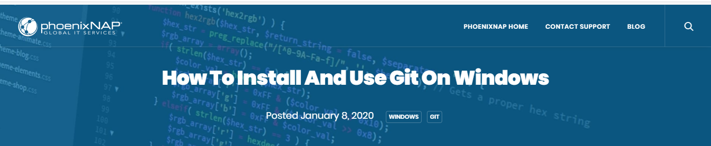
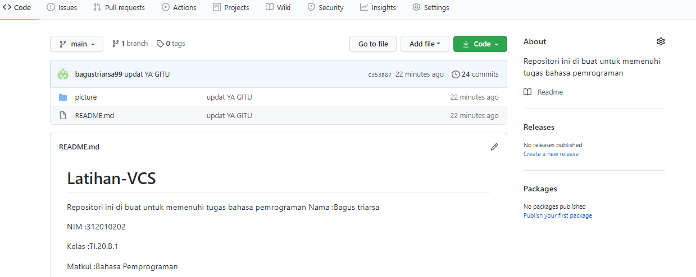

# Latihan-VCS
Repositori ini di buat untuk memenuhi tugas bahasa pemrograman
Nama        :Bagus triarsa

NIM         :312010202

Kelas       :TI.20.B.1

Matkul      :Bahasa Pemprograman

## Langkah langkah penggunaan git

* Download Git dahulu, dengan link berikut ini : [Click here](https://git-scm.com/)

* Setelah file terdonwload, silahkan lakukan instalasi dengan reerensi berikut ini : [git instalation Guide](https://phoenixnap.com/kb/how-to-install-git-windows)

* Setelah Instalasi selesai, buka *softwere* GitBash pada menu di Windows, dan lakukan pengecekan Versi, dengan mengetik *syntax* berikut :[git instalation guide] 
> git --version

* Buat akun https://github.com/, seperti contoh dibawah ini. Dan lakukan *verifikasi* akun melalui email yang sudah terdaftar.

* Jika akun GitHub sudah selesai dibuat dan terverivikasi, proses selanjutnya silahkan buat *Repository* seperti gambar dibawah ini. 

* Jika repositiry sudah didibuat maka akan muncul tampilan seprti dibawah ini.

* Pembuatan akun dan repository pada GitHub telah selesai, saat ini akan kita lakukan untuk *me-remote* reposytory GitBash lokal. Bagaimana caranya? Langkah pertama kita harus menyalin *link* *URL* git kita di GitHub, dengan cara tekan tombol code lalu klik *Copy*

* Setelah *Link URL* git kita ter*copy*, Silahkan buka File Explirer pada Windows, kemudian pilih folder dimana kita akan men*donwload*nRepository dari GitHub ke lokal. Kemudian Klik Kanan, pilih **Git Bash Here**.

* Pop *Up Command Promot* (CMD) akan terluka. pada proses ini kita akan melakukan download file repository yang tadi dibuat, dengan mengetikkan *syntax* berikut :
> git clone [URL] pada contohnya, saya akan memasukkan *git clone https://github.com/bagustriarsa99/Latihan-VCS.git*

* Setelah proses cloning selesai, pada saat ini kita masih pada folder awal (master), kita harus masuk kedalam folder yang telah dicloning tadi yaitu *Latihan VCS* dengan mengetikkan *syntax* berikut :
>cd LatihanVCS/

* Saat ini kita sudah masuk kedalam folder *LatihanVCS*. Silahkan edit file **README.md** yang ada di File Explorer. Bisa menggunakan Texs Editor (Sublime Texs, Notepad, Notpad++, Visual Studio Code). Edit sesuai dengan keinginan. Aturan file.md (Markdown) bisa di lihat di Link berikut ini : 

 Setelah file README.md diedit, silahkan simpan file tersebut dengan cara **CTRL+S** atau file -> save

 * Langkah selanjutnya setelah file disimpan kita kembali pada App Git Bash (CMD) ketik pada Git Bash seperti berikut ini : 

> git add .

* Setelah selesai melakukan git add, langkah berikutnya kita akan melakukan *commit*. Fungsi commit adalah untuk menyimpan perubahan yang dilakukan, tetapi tidak ada perubahan pada remote repository. Ketik pada App Git Bash seperti berikut ini :

> git commit "Update READMY.md"

* Git *commit* telah selesai dilakukan. Untuk saat ini akan melakukan 
Git Push berfungsi untuk mengirimkan perubahan file setelah di commit ke remote repository. Silahkan ketik pada App Git Bash seperti berikut ini :

> git push 

* Semua proses telah selesai, silahkan kembali ke Web Browser untuk melihat perunahan yang telah di *commit* dan push dari remote.

Hal diatas adalah Cara langkah-langkah penggunaan Git 

## SEKIAN DAN TERIMA KASIH

# BAGUS TRIARSA - 312010202 - TI.20.B.1 -TEKNIK INFORMATIKA - UNIVERSITAS PELITA BANGSA 

